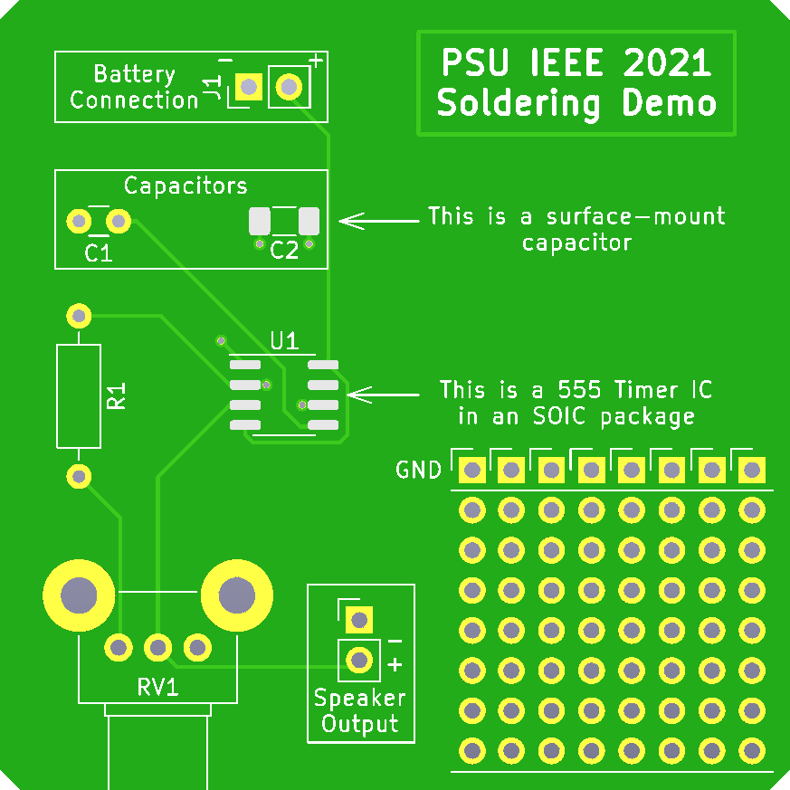
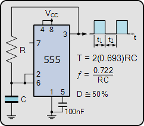

# Penn State IEEE
## Soldering Workshop
Thursday, September 2nd from 6-8pm

### About 
A short workshop to teach TH and SMD soldering techniques. In this workshop, participants will learn to solder starting on perfboard, and finishing on a custom 555 demo PCB.

### Required Tools
- Soldering iron and spool of solder
- Hot air rework station (optional)
- Fume extractor (optional)
- Silicon heat pad (optional)

### Parts List
- Demo PCB
- SOIC-8 LM555
- 100nF capacitor
- 220nF capacitor (SMD 1206)
- 1K resistor
- 10K Alps RK09K Potentiometer
- Small Speaker

### Resources
- [Electronics-Tutorials: 555 Generator Circuits](https://www.electronics-tutorials.ws/waveforms/555-circuits-part-1.html)

