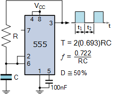

# Penn State IEEE
## Soldering Workshop
Date TBA

### About 
WIP

### Required Tools
- WIP

### Parts List
- WIP

### Resources
- [Electronics-Tutorials: 555 Generator Circuits](https://www.electronics-tutorials.ws/waveforms/555-circuits-part-1.html)
